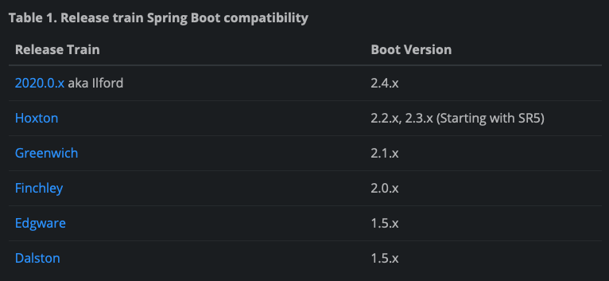

# Bank

> 은행 업무 MSA 구축

## 환경구성

- Spring Boot : 2.3.8.RELEASE

  - 2.4.X 버전의 경우 Spring Cloud의 Hoxton.SR이 지원하지 않음 
    + [https://spring.io/projects/spring-cloud](https://spring.io/projects/spring-cloud)  
    + [Spring Cloud Hoxton Release Notes](https://github.com/spring-cloud/spring-cloud-release/wiki/Spring-Cloud-Hoxton-Release-Notes)
      
    

- Spring Cloud : Hoxton.SR8
- Lombok
- JPA
- MySQL
    + 각 Application 별 DB 서버 분리

## Application 정보

| Application | port |
| ----------- | ---- |
| Customer    | 8076 |
| Account     | 8075 |
